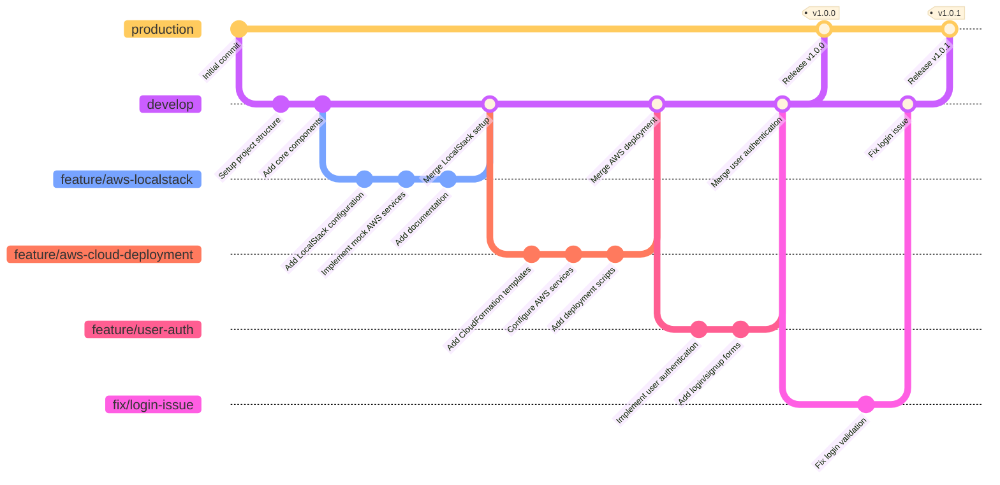
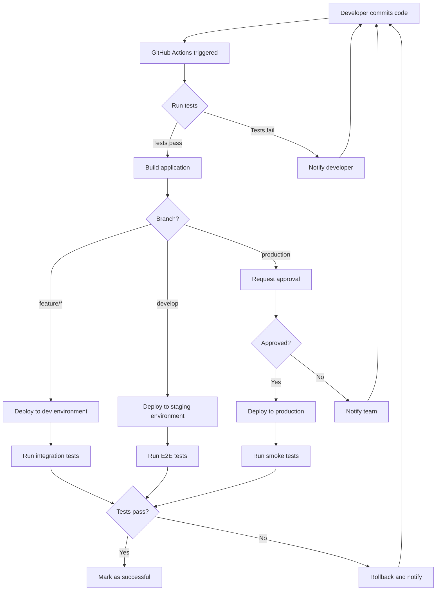
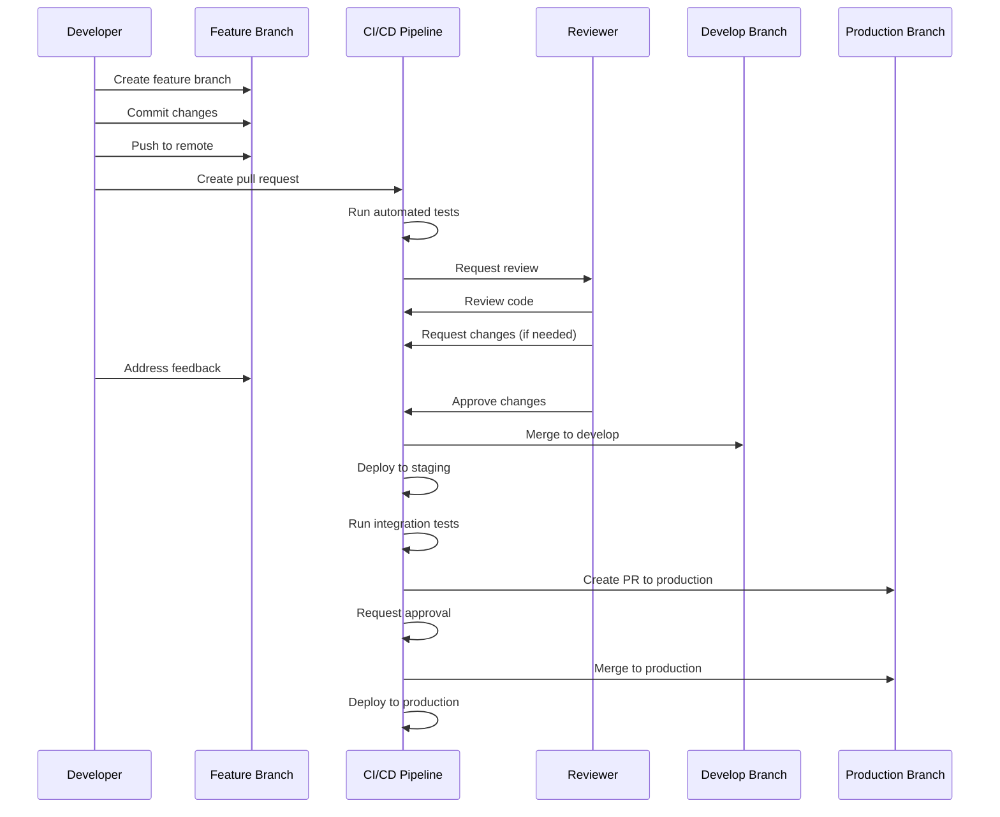
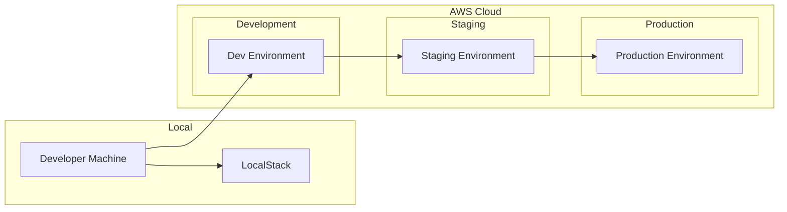
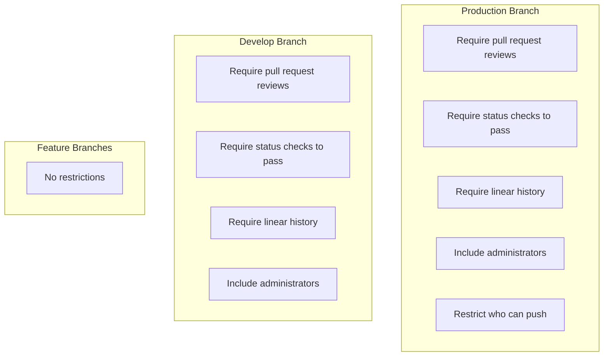
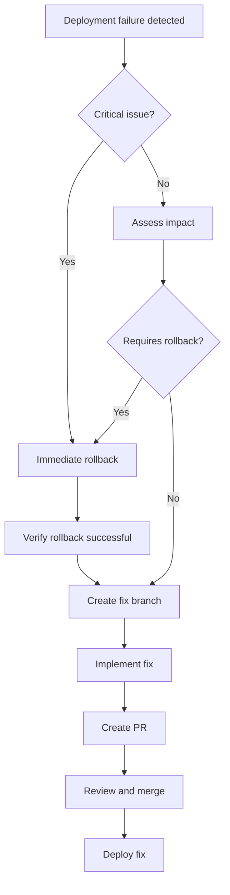

# Branching Strategy and CI/CD Pipeline

This document provides a visual representation of our Git branching strategy and CI/CD pipeline.

## Branching Strategy Diagram

## CI/CD Pipeline Diagram

## Pull Request Workflow

## Deployment Environments

## Branch Protection Rules

## Rollback Process

These diagrams provide a visual representation of our branching strategy, CI/CD pipeline, and related workflows. They should be used as a reference for all team members to understand the development and deployment processes.